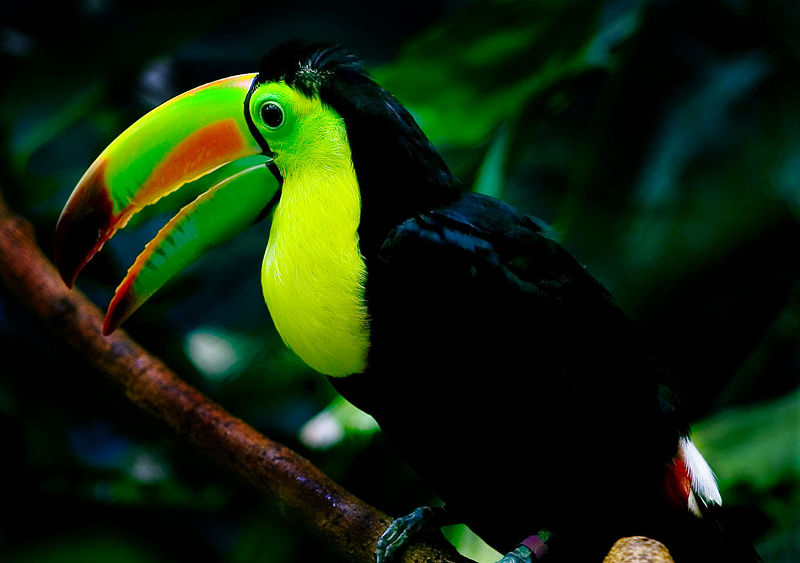

# tukan
## _a C++ header-only color conversion- and computation-library_

## Features (Summary):
* almost complete `<cmath>`-implementation for linear RGB
* header only, no further dependencies except a C++11 compiler (or newer)
* no macros (except include guards)

### RGB features:
* complete implementation of the __C++11 `<cmath>`__ header, with the following exceptions:
 * the macros `NAN`, `INFINITY`, `HUGE_VAL`, `HUGE_VALF`, `HUGE_VALL` are unimplemented (that's because macros cannot be overloaded)
 * the classification functions (`fpclassify`, `isfinite`, `isinf`, `isnan`, `isnormal`, `signbit`) and
   comparison functions (`isgreater`, `isgreaterequal`, `isless`, `islessequal`, `islessgreater`, `isunordered`)

## Planned features:

* almost lossless conversion of RGB colors to color spectrums (and back)
* sRGB from and to RGB
* HSV, CIE XYZ, YUV and all color spaces that exist (in the whole universe (and beyond))

### RGB features:
* complete `<cstdlib>` math functions implementation
* `<numeric_limits>` implementation

More info later.

-------------------------------------------------------------------------------

## "Can I participate?"

Yes. But beware that we strive for complete unit test coverage (I would assist
with that). And all algorithms need citations (in the longer term).

The coding style in its essence reduces to 
clean, self-documenting, well-engineered and maintanable code. Users of this
library should be able to use just the library sources for quick documentation
lookup purposes. And release code must only depend on C++11 (incl. the standard
library, of course). Compile time is a respected issue, too (remember: header only).

**The code should be stable and portable (within C++11) as _oops_!**

If this is all okay, you are very welcome, especially if you are an expert on
some color space.

-------------------------------------------------------------------------------

Build/Test:

* `scons`
* `scons test`

-------------------------------------------------------------------------------

## License

(C) 2013 Sebastian Mach (1983), the files contained in tukan (C++ color 
conversion and computation library) are published under the terms of the GNU
General Public License, Version 3 (a.k.a. GPLv3).

